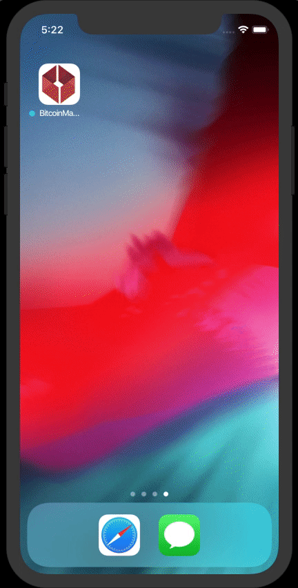

# Bitcoin Market Price
### DB1 Global Software Code Challenge - iOS

### Preview

### Installation
Bitcoin Market Price iOS App was developed with swift 4.2 and is compatible with Xcode 10.2+.

### Get Started
Open the file "BitcoinMarketPrice.xcworkspace" and press (command) ⌘ + R to run the project.

### Coding Explanation
To manage the requests, I chose to create my own network layer. Despite the little experience with this design pattern I tried to implement MVVM to my project by understanding the benefits it provides mainly in regards to scalability and testability.

### Todos
 - Add Unit Tests

### License
**Free Software, Hell Yeah!**